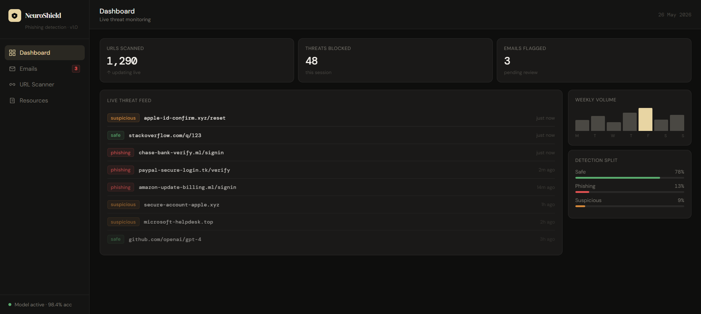
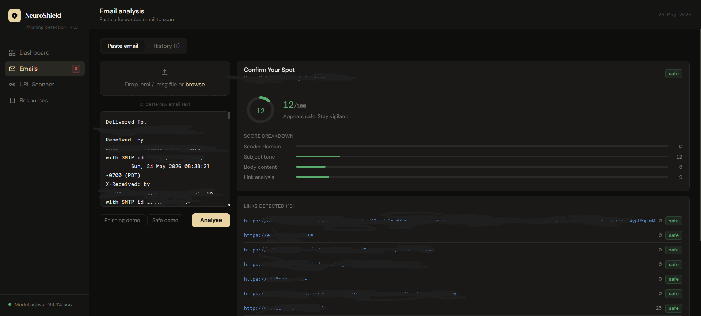
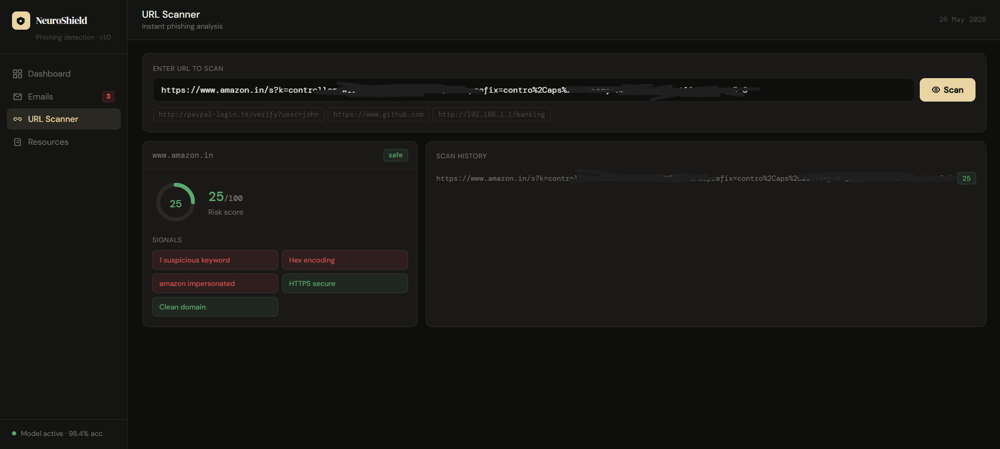
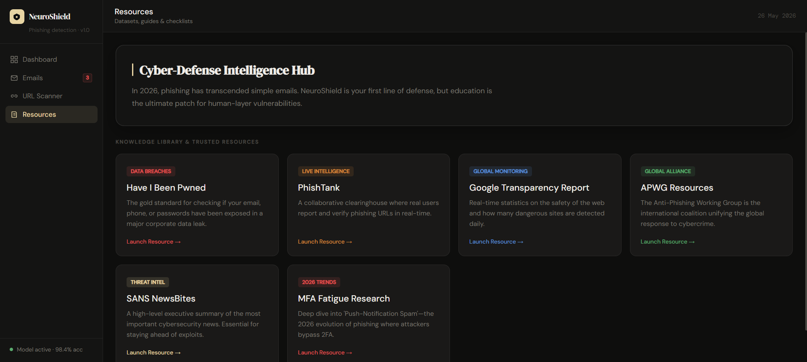

# NeuroShield

Real-time phishing detection for URLs and emails.  
Stacked ML ensemble trained on two Kaggle datasets.

---
## Why NeuroShield?
I built this to move beyond static email filters. NeuroShield correlates email content with URL behavior, using a stacked ensemble to mitigate the weaknesses of individual algorithms against modern adversarial tactics like link obfuscation and brand impersonation.

---

## Project structure

```
neuroshield/
├── data_loader.py      Downloads + normalises both Kaggle datasets
├── features.py         URL and email feature extraction (35 URL + 12 email meta features)
├── url_model.py        URL classifier (RF + GBM → LR stacking)
├── email_model.py      Email classifier (TF-IDF + SVC + RF → LR stacking)
├── api.py              FastAPI backend (6 endpoints)
├── train.py            One-shot training script
├── tests.py            Offline test suite (no Kaggle needed)
├── requirements.txt
└── models/             Created after training
    ├── url_model.pkl
    ├── url_meta.json
    ├── email_model.pkl
    └── email_meta.json
```
## Project Preview

<div align="center">
  <table>
    <tr>
      <td align="center"><b>Dashboard</b><br></td>
      <td align="center"><b>Email Analysis</b><br></td>
    </tr>
    <tr>
      <td align="center"><b>URL Analysis</b><br></td>
      <td align="center"><b>Resources</b><br></td>
    </tr>
  </table>
</div>

## Datasets

| Model | Dataset | Kaggle slug |
|-------|---------|-------------|
| Email | Spam Email Dataset | `jackksoncsie/spam-email-dataset` |
| URL   | Malicious URLs Dataset | `sid321axn/malicious-urls-dataset` |

---

## Quick start

### 1. Install dependencies

```bash
pip install -r requirements.txt
```

### 2. Configure Kaggle credentials

1. Go to https://www.kaggle.com/settings → API → **Create New Token**
2. This downloads `kaggle.json`
3. Place it at `~/.kaggle/kaggle.json`
4. Set permissions: `chmod 600 ~/.kaggle/kaggle.json`

### 3. Train the models

```bash
python train.py
```

Datasets are downloaded automatically on first run and cached in `.dataset_cache/`.  
Training takes ~5–15 minutes depending on hardware.

Options:
```bash
python train.py --url-only            # URL model only
python train.py --email-only          # Email model only
python train.py --url-sample 50000    # Smaller URL sample (faster)
```

### 4. Start the API

```bash
uvicorn api:app --host 0.0.0.0 --port 8000 --reload
```

Swagger UI: http://localhost:8000/docs

### 5. Run tests

```bash
python tests.py
```

Tests use synthetic data — no Kaggle credentials required.

---

## API reference

### URL endpoints

**Analyse a URL**
```bash
POST /api/url/predict
{"url": "http://paypal-login.tk/verify?user=john"}
```

**Batch analyse URLs**
```bash
POST /api/url/batch
{"urls": ["https://google.com", "http://evil.tk/phish"]}
```

### Email endpoints

**Analyse email body text**
```bash
POST /api/email/predict
{"text": "URGENT: Your account has been suspended..."}
```

**Parse + analyse a full forwarded email**
```bash
POST /api/email/parse
{
  "raw": "From: evil@paypa1.tk\nSubject: Urgent\n\nYour account is suspended..."
}
```

Returns: parsed headers, email classification, per-URL analysis, combined risk score.

### System endpoints

```
GET /health                  Liveness check
GET /api/models/status       Loaded models + metrics
GET /api/models/url/meta     URL model feature importances
GET /api/models/email/meta   Email model metrics
```

---

## Response format

**URL prediction:**
```json
{
  "url": "http://paypal-login.tk/verify",
  "label": "malicious",
  "risk_score": 94.2,
  "confidence": 0.942,
  "rf_prob": 0.961,
  "gb_prob": 0.938,
  "indicators": [
    {"signal": "No HTTPS",           "risk": "high"},
    {"signal": "Risky TLD",          "risk": "high"},
    {"signal": "Brand impersonation","risk": "high"}
  ],
  "features": { ... },
  "latency_ms": 12.4
}
```

**Email parse result:**
```json
{
  "parsed": {
    "from": "support@paypa1.tk",
    "subject": "Urgent: Verify now",
    "body_preview": "Your account has been suspended..."
  },
  "email_analysis": {
    "label": "spam",
    "risk_score": 88.1,
    "confidence": 0.881,
    "indicators": [ ... ]
  },
  "url_analysis": [ ... ],
  "combined_score": 91.3,
  "combined_label": "phishing",
  "latency_ms": 34.7
}
```

---

## Model architecture

### URL model
- **35 features**: URL length, HTTPS, IP in hostname, TLD risk, brand-in-subdomain, suspicious keywords, entropy, hex encoding, redirect params, shorteners, digit ratios, subdomain depth
- **Layer 1**: RandomForest (400 trees) + GradientBoosting (200 trees)
- **Layer 2**: LogisticRegression meta-learner on 5-fold OOF probabilities
- **Dataset**: ~200k stratified rows from sid321axn/malicious-urls-dataset (4 classes → binary)

### Email model
- **Text**: char n-gram TF-IDF (3–5 grams, 60k features) + word n-gram TF-IDF (1–2 grams, 40k features) → calibrated LinearSVC
- **Meta**: 12 handcrafted features (length, caps ratio, URL count, exclamation count, phishing phrase count, HTML presence) → RandomForest
- **Layer 2**: LogisticRegression stacking over 5-fold OOF
- **Dataset**: jackksoncsie/spam-email-dataset

---

## Connecting the frontend

The `NeuroShield.html` frontend talks to this API. Set `API_BASE` in the HTML file:

```js
const API_BASE = "http://localhost:8000";
```

All endpoints return JSON with CORS headers set to `*` (restrict in production).

---

## Environment variables

| Variable | Default | Description |
|----------|---------|-------------|
| `KAGGLE_CONFIG_DIR` | `~/.kaggle` | Path to directory containing `kaggle.json` |
| `NEUROSHIELD_MODELS_DIR` | `./models` | Where trained models are saved |

---

## Future Roadmap
- **Agentic Orchestration:** Integrate LLM-driven autonomous "sandbox" visits for real-time verification of detected threats.
- **Human-in-the-Loop:** Add feedback endpoints for users to report false-positives/negatives to refine model weights.
